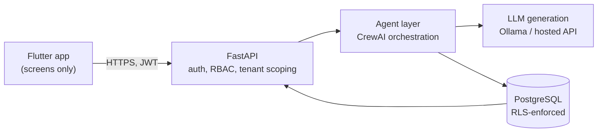
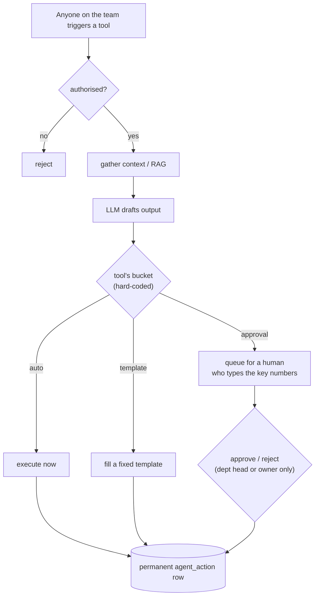

<div align="center">

# 🤝 handled.ai

### An AI operations assistant for small businesses — that always asks before it commits.

Routine ops work runs on autopilot. Anything **binding, costly, or hard to undo**
is drafted by the AI and waits for a human to approve it — and to type the key
numbers in themselves.

<br/>


</div>

---

## Table of contents

- [The problem](#the-problem)
- [The safety model](#the-safety-model)
- [Who can do what](#who-can-do-what)
- [Architecture](#architecture)
- [How a request flows](#how-a-request-flows)
- [Repo layout](#repo-layout)
- [Quickstart](#quickstart)
- [Demo data](#demo-data)
- [Testing](#testing)
- [Project status](#project-status)
- [Documentation](#documentation)

## The problem

Small and mid-size Indian companies (roughly 10–100 employees) routinely run
without dedicated ops/logistics staff. Tracking task status, watching stock,
chasing vendors, raising purchase orders — it happens informally, inconsistently,
or lands entirely on the owner.

Existing "AI employee" products either assume you already have staff to assist,
or offer full autonomy with no credible way to earn a small owner's trust.
Neither fits a company with **no** ops staff and **low** tolerance for an
unsupervised AI signing off on a purchase order in its name.

**handled.ai** gives that company a pre-built Ops module: low-risk work is
automatic, everything risky is drafted for a human, and every action is logged.

## The safety model

Every AI action falls into one of three autonomy buckets. The classification is
**hard-coded per tool** in [`backend/agent/tool_registry.py`](backend/agent/tool_registry.py)
— never decided by the model at runtime.

| Bucket | Rule | Ops tools |
|---|---|---|
| 🟢 **auto** | Internal, low-risk, easily undone. Runs immediately. | `ops_status_summary`, `inventory_qa` (RAG) |
| 🟡 **template-restricted** | External-facing but low-stakes. Wording is a fixed, pre-approved template — never freely generated. | `vendor_status_update` |
| 🔴 **approval-required** | Binding, financial, hard to undo, or free external wording. AI drafts; a human approves. | `purchase_order_approval`, `workflow_exception_approval` |

Three rules that never bend:

1. **Everything is logged.** Every call writes a permanent `agent_action` row,
   regardless of bucket. Nothing is deleted or overwritten on reject.
2. **Humans type the numbers.** For anything involving money or dates, the AI
   writes the wording but the approver enters the actual figures — the Approve
   button stays disabled until they do, and the server rejects zero, negative or
   non-numeric figures even if the API is called directly. No rubber-stamping an
   AI guess.
3. **Isolation is enforced twice.** Application-level `company_id` scoping **and**
   PostgreSQL Row-Level Security as an independent backstop. The app connects as
   a non-superuser role so RLS always applies.

Decisions are also race-safe: the action row is locked while a human decides,
so two people acting at once can't both "win" and leave a record that
contradicts itself.

## Who can do what

Roles are hard-coded too (in [`backend/routers/auth.py`](backend/routers/auth.py))
and enforced by the server — the app only reflects them.

| Role | Trigger tools / draft work | Approve or reject | Add team members |
|---|:---:|:---:|:---:|
| **Owner** (created at signup) | ✅ | ✅ | ✅ |
| **Department head** | ✅ | ✅ | — |
| **Staff** | ✅ | — (403) | — |

Junior staff draft with the agent; a senior commits. Every audit row names **who
triggered it and who decided it**, and the History screen shows the whole
company's trail — so an owner sees everyone's work, with the reason given for
each decision.

> [!NOTE]
> This is an academic prototype (B.Tech design project). Generation runs on a
> locally fine-tuned model via Ollama by default, or a third-party LLM API — the "your data never leaves your servers"
> positioning is a later, self-hosted phase and is **not** a claim this prototype
> makes.

## Architecture



Four layers, kept separate on purpose. The agent layer isolates **orchestration**
(tool choice, prompt building, RAG, bucket lookup, persistence) from
**generation** (a plain LLM call with no DB or rules awareness) so the model can
be swapped — hosted API today, self-hosted later — without touching the rest.

## How a request flows



## Repo layout

```
backend/              FastAPI service
  main.py               app + routers + /health
  routers/             auth · company (signup) · team (members) · ops/ (one file per tool)
  agent/
    crew.py              run_tool() dispatcher + per-tool prompts + provider switch
    rag.py              per-company Chroma store for inventory_qa
    tool_registry.py    the hard-coded risk-classification table
  models/              SQLAlchemy ORM + Pydantic schemas
  db/                  session (runtime + admin engines) · RLS setup
  init_db.py            create tables + RLS on a fresh database
  migrate.py            bring an existing database up to the current schema
  seed_demo.py          realistic demo companies + team, via the real API
  eval_injection.py     prompt-injection harness (fenced vs unfenced prompt)
  eval_ops_quality.py   behavioural eval against the product's safety claims
  training/            QLoRA fine-tuning pipeline → GGUF → Ollama (handled-ops)
  tests/               pytest — isolation, audit log, roles, injection, cost caps
handled_app/          Flutter app (Windows + Web)  →  see handled_app/README.md
  lib/screens/         login · signup · overview · ops tools · approvals · history · team
docs/                 problem statement · architecture · decisions log · plan · demo script
CLAUDE.md             working notes for contributors / AI assistants
```

## Quickstart

### Prerequisites

- Python 3.11 · PostgreSQL 16 · Flutter 3.44 (Dart 3.12)
- [Ollama](https://ollama.com) for local, no-cost generation (optional — see below)

### 1 · Backend

```bash
cd backend
python -m venv ../venv
../venv/Scripts/activate            # Windows;  source ../venv/bin/activate on *nix
pip install -r requirements.txt

cp .env.example .env                # edit: DB URLs, JWT_SECRET, LLM provider
python init_db.py                   # fresh DB: create tables + apply RLS policies
python migrate.py                   # existing DB: bring it up to the current schema (safe to re-run)
python test_rls_manual.py           # prove tenant isolation before building on it

uvicorn main:app --reload           # → http://localhost:8000   (/docs for Swagger)
```

> [!IMPORTANT]
> Create the DB `handled_dev` plus a **non-superuser** role `handled_app` that
> owns nothing. The app connects as `handled_app` so RLS is enforced;
> `init_db.py` and migrations use the superuser.

### 2 · LLM

The default model is **`handled-ops`** — Qwen2.5-3B fine-tuned with QLoRA on
synthetic Ops data (never real company data). The pipeline lives in
[`backend/training/`](backend/training/): `synthesize_data.py` → `train_lora.py`
→ `export_gguf.py`, then register the GGUF with Ollama:

```bash
cd backend/training/models/handled-ops-qwen2.5-3b
ollama create handled-ops -f Modelfile     # weights are gitignored — build them locally
```

In `backend/.env`: `LLM_PROVIDER=ollama`, `LLM_MODEL=handled-ops`. Start Ollama
before the backend. No GPU for training? Use a base model instead
(`ollama pull llama3.2`, `LLM_MODEL=llama3.2`), or set `LLM_PROVIDER` to
`anthropic` / `openai` / `gemini` with the matching API key.

If no model is reachable the tools still work — they return clearly-labelled
fallback text instead of crashing.

### 3 · App

```bash
cd handled_app
flutter pub get
flutter run -d chrome             # or -d windows (needs Windows Developer Mode on)
```

## Demo data

With the backend and Ollama running:

```bash
cd backend && ../venv/Scripts/python seed_demo.py     # ~1 minute
```

Creates two companies through the real API, so every row holds genuine model
output:

- **Company A** — an owner, a department head and a staff member; history across
  all three buckets (including an approved PO and a rejected exception, each with
  the approver's reason), plus **two items drafted by staff and left pending** for
  the live "a senior types the numbers and approves" moment.
- **Company B** — a second tenant, to show isolation live.

It prints every login at the end. Each run makes fresh companies, so re-run it
whenever the pending items have been used up. The walkthrough is in
[`docs/Demo_Script.md`](docs/Demo_Script.md).

## Testing

```bash
# backend — 56 tests: tenant isolation, audit-log integrity, roles, concurrent
# decisions, prompt-injection fencing, department routing, cost-control caps
cd backend && ../venv/Scripts/python -m pytest
python test_rls_manual.py           # raw-SQL RLS proof

# model behaviour — needs Ollama + handled-ops
python eval_ops_quality.py          # PO figure suppression, grounded refusal, no invented numbers
python eval_injection.py --compare  # injected RAG content: fenced vs unfenced prompt

# app — 40 tests
cd ../handled_app && flutter analyze && flutter test
```

## Project status

8-week prototype — the build is complete; demo rehearsal is what remains.

- ✅ Auth, multi-tenant data model with RLS from day one
- ✅ All 5 Ops tools end-to-end across the three buckets
- ✅ Approval queue with mandatory manual number entry, enforced server-side
- ✅ Full audit trail — History screen, per-action detail, who/when/why for every decision
- ✅ Team members with roles — staff draft, department heads and the owner approve
- ✅ Dashboard analytics — how much ran without a human, how often humans reject
- ✅ Hardening — adversarial cross-tenant tests, prompt-injection fencing, race-safe decisions
- ✅ Locally fine-tuned model (`handled-ops`) with behavioural evals
- ✅ Demo seed data + scripted walkthrough with a fallback plan
- ⬜ Rehearse the demo end to end
- ⬜ Later — vLLM serving · email invites / password reset · a second department module

Known limits are listed honestly in [`docs/Status_and_Approach.md`](docs/Status_and_Approach.md)
— e.g. the 3B model occasionally mistypes a part code in a draft, which is
contained by design because a human enters the binding figures.

See [`docs/Implementation_Plan.md`](docs/Implementation_Plan.md) for the full
phase plan and [`docs/Progress.md`](docs/Progress.md) for a running log.

## Documentation

| Doc | What it covers |
|---|---|
| [`docs/ps.md`](docs/ps.md) | Problem statement, scope, personas, honest risks |
| [`docs/arch.md`](docs/arch.md) | 4-layer architecture, data model, request lifecycle, risk table |
| [`docs/Implementation_Plan.md`](docs/Implementation_Plan.md) | Phase-by-phase build plan and edge cases |
| [`docs/Prototype_Step_By_Step_Build_Guide.md`](docs/Prototype_Step_By_Step_Build_Guide.md) | Linear week-by-week checklist |
| [`docs/handled.ai - Decisions Log.md`](docs/handled.ai%20-%20Decisions%20Log.md) | Every settled decision and why — read before proposing changes |
| [`docs/Status_and_Approach.md`](docs/Status_and_Approach.md) | Honest status by area, measured model quality, what not to build |
| [`docs/Demo_Script.md`](docs/Demo_Script.md) | The incubator walkthrough, timings, and the fallback plan |
| [`docs/Progress.md`](docs/Progress.md) | What's built so far |
