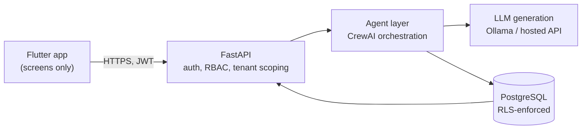
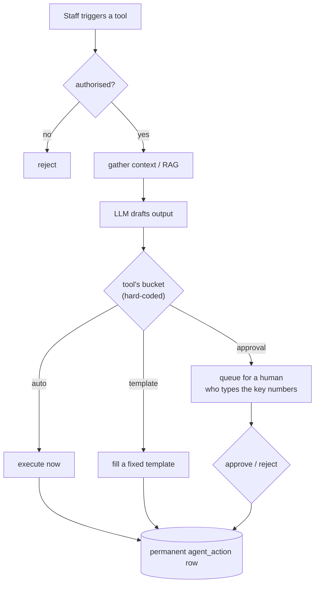

<div align="center">

# 🤝 handled.ai

### An AI operations assistant for small businesses — that always asks before it commits.

Routine ops work runs on autopilot. Anything **binding, costly, or hard to undo**
is drafted by the AI and waits for a human to approve it — and to type the key
numbers in themselves.

<br/>


</div>

---

## Table of contents

- [The problem](#the-problem)
- [The safety model](#the-safety-model)
- [Architecture](#architecture)
- [How a request flows](#how-a-request-flows)
- [Repo layout](#repo-layout)
- [Quickstart](#quickstart)
- [Testing](#testing)
- [Project status](#project-status)
- [Documentation](#documentation)

## The problem

Small and mid-size Indian companies (roughly 10–100 employees) routinely run
without dedicated ops/logistics staff. Tracking task status, watching stock,
chasing vendors, raising purchase orders — it happens informally, inconsistently,
or lands entirely on the owner.

Existing "AI employee" products either assume you already have staff to assist,
or offer full autonomy with no credible way to earn a small owner's trust.
Neither fits a company with **no** ops staff and **low** tolerance for an
unsupervised AI signing off on a purchase order in its name.

**handled.ai** gives that company a pre-built Ops module: low-risk work is
automatic, everything risky is drafted for a human, and every action is logged.

## The safety model

Every AI action falls into one of three autonomy buckets. The classification is
**hard-coded per tool** in [`backend/agent/tool_registry.py`](backend/agent/tool_registry.py)
— never decided by the model at runtime.

| Bucket | Rule | Ops tools |
|---|---|---|
| 🟢 **auto** | Internal, low-risk, easily undone. Runs immediately. | `ops_status_summary`, `inventory_qa` (RAG) |
| 🟡 **template-restricted** | External-facing but low-stakes. Wording is a fixed, pre-approved template — never freely generated. | `vendor_status_update` |
| 🔴 **approval-required** | Binding, financial, hard to undo, or free external wording. AI drafts; a human approves. | `purchase_order_approval`, `workflow_exception_approval` |

Three rules that never bend:

1. **Everything is logged.** Every call writes a permanent `agent_action` row,
   regardless of bucket. Nothing is deleted or overwritten on reject.
2. **Humans type the numbers.** For anything involving money or dates, the AI
   writes the wording but the approver enters the actual figures — the Approve
   button stays disabled until they do. No rubber-stamping an AI guess.
3. **Isolation is enforced twice.** Application-level `company_id` scoping **and**
   PostgreSQL Row-Level Security as an independent backstop. The app connects as
   a non-superuser role so RLS always applies.

> [!NOTE]
> This is an academic prototype (B.Tech design project). Generation uses a local
> model or a third-party LLM API — the "your data never leaves your servers"
> positioning is a later, self-hosted phase and is **not** a claim this prototype
> makes.

## Architecture



Four layers, kept separate on purpose. The agent layer isolates **orchestration**
(tool choice, prompt building, RAG, bucket lookup, persistence) from
**generation** (a plain LLM call with no DB or rules awareness) so the model can
be swapped — hosted API today, self-hosted later — without touching the rest.

## How a request flows



## Repo layout

```
backend/              FastAPI service
  main.py               app + routers + /health
  routers/             auth · company · ops/ (one file per tool)
  agent/
    crew.py              run_tool() dispatcher + per-tool prompts + provider switch
    rag.py              per-company Chroma store for inventory_qa
    tool_registry.py    the hard-coded risk-classification table
  models/              SQLAlchemy ORM + Pydantic schemas
  db/                  session (runtime + admin engines) · RLS setup
  tests/              Phase 3 hardening — pytest
handled_app/          Flutter app (Windows + Web)  →  see handled_app/README.md
  lib/screens/         login · signup · dashboard · ops tools · approval queue
docs/                 problem statement · architecture · decisions log · plan · progress
CLAUDE.md             working notes for contributors / AI assistants
```

## Quickstart

### Prerequisites

- Python 3.12 · PostgreSQL 16 · Flutter 3.4+
- Optional: [Ollama](https://ollama.com) for local, no-cost generation

### 1 · Backend

```bash
cd backend
python -m venv ../venv
../venv/Scripts/activate            # Windows;  source ../venv/bin/activate on *nix
pip install -r requirements.txt

cp .env.example .env                # edit: DB URLs, JWT_SECRET, LLM provider
python init_db.py                   # create tables + apply RLS policies
python test_rls_manual.py           # prove tenant isolation before building on it

uvicorn main:app --reload           # → http://localhost:8000   (/docs for Swagger)
```

> [!IMPORTANT]
> Create the DB `handled_dev` plus a **non-superuser** role `handled_app` that
> owns nothing. The app connects as `handled_app` so RLS is enforced;
> `init_db.py` and migrations use the superuser.

### 2 · LLM

```bash
ollama pull llama3.2               # or a lighter tag: llama3.2:1b · qwen2.5:3b
```

If no model is reachable the tools still work — they return clearly-labelled
fallback text instead of crashing. Set `LLM_PROVIDER` to `anthropic` / `openai` /
`gemini` (with the matching API key) to use a hosted model.

### 3 · App

```bash
cd handled_app
flutter pub get
flutter run -d chrome             # or -d windows (needs Windows Developer Mode on)
```

## Testing

```bash
# backend — Phase 3: tenant isolation, audit-log integrity, cost-control caps
cd backend && ../venv/Scripts/python -m pytest
python test_rls_manual.py         # raw-SQL RLS proof

# app
cd ../handled_app && flutter analyze && flutter test
```

## Project status

8-week prototype, built weeks 3–6 of the plan:

- ✅ Auth, RBAC, multi-tenant data model with RLS from day one
- ✅ All 5 Ops tools end-to-end across the three buckets
- ✅ Approval queue with mandatory manual number entry
- ✅ Phase 3 hardening — adversarial cross-tenant + audit-log test suite
- ⬜ Weeks 7–8 — demo data, demo script, rehearsals
- ⬜ Later — self-hosted fine-tuned model (vLLM) · a second department module

See [`docs/Implementation_Plan.md`](docs/Implementation_Plan.md) for the full
phase plan and [`docs/Progress.md`](docs/Progress.md) for a running log.

## Documentation

| Doc | What it covers |
|---|---|
| [`docs/ps.md`](docs/ps.md) | Problem statement, scope, personas, honest risks |
| [`docs/arch.md`](docs/arch.md) | 4-layer architecture, data model, request lifecycle, risk table |
| [`docs/Implementation_Plan.md`](docs/Implementation_Plan.md) | Phase-by-phase build plan and edge cases |
| [`docs/Prototype_Step_By_Step_Build_Guide.md`](docs/Prototype_Step_By_Step_Build_Guide.md) | Linear week-by-week checklist |
| [`docs/handled.ai - Decisions Log.md`](docs/handled.ai%20-%20Decisions%20Log.md) | Every settled decision and why — read before proposing changes |
| [`docs/Progress.md`](docs/Progress.md) | What's built so far |
